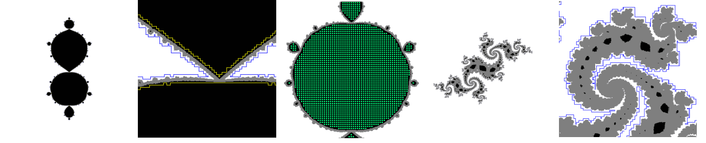

# julia-polygon
Constructing polygons to describe the interior and exterior of Julia sets.

### Purpose of this code

Code to construct simple closed polygons consisting of just horizontal and 
vertical segments that circumference a structure from the outside or interior 
regions from the inside. The polygons can be used to check for a complex 
number whether it definitely, i.e. with mathematical certainty, is a member of a Julia 
set, is not a member of the set or if it cannot be judged. The set itself must be 
computed in a trustworthily manner, e.g. with the
algorithm by Figueiredo et al. (see literature).

### The readme is organized as follows:

1. Quick start
2. Background
3. Quality controlling the polygons
4. Command-line options
5. Limitations
6. Literature / forum
7. Contact

## 1. Quick start

Compile the source code with a C++ compiler, assuming the executable is named `polygon.exe`.

Open a command prompt and go to the subdirectory `_EXAMPLE01`. Therein click 
`_START.bat`. This creates a set of polygons from the input image `_in.bmp` (the Douady rabbit), outputs 
an image `_QC_PASSED...`  that contains a small version of the input image - but 
constructed using only numbers from the complex plane and the polygons - and an image with all polygons drawn
into, `_FINAL_all_polygons.bmp`

More examples show the usage of the command line parameters. Example no. 5 is
very time-consuming when performing the quality check, the construction itself only takes a few minutes.

## 2. Background

In the quadratic Mandelbrot set there are formulas for the interior of the main 
cardioid or the period-2 bulb (see e.g. wikipedia). So one can easily check for a lot
of complex numbers whether they need to be considered for certain areas of fractal 
generation.

The polygons created here can be used the same way for other regions of trustworthily 
computed Julia or Mandelbrot sets (algorithm by Figueiredo, see literature). It is
mandatory to use those types of sets and not point-sampled ones as in the former
a pixel represents a square in the complex plane and its fate is identical
for all complex numbers in that square which is not the case for point-sampled
images. And since the polygons circumference area for them to work as intended the
area itself needs to be totally determined in its fate - escaping or not.

The software reads an input image of fixed name `_in.bmp` (8-bit bitmap format) that 
consists of pixels in white (definite exterior of the set), black (definite interior) 
and gray (undetermined) color. It constructs a set of non-overlapping polygons to 
describe the exterior - often one exterior polygon suffices, but in case of a 
disconnected filled-in Julia set, several structure-encompassing polygons are needed. 
The interior region is often disconnected.

The polygon vertices lie on a grid of width 2^-25 in the complex plane. A complex 
number to be judged is identified with the grid point to its lower left. This grid 
point and two layers of neighbours in each direction are actually entered into the 
oracle - if the answer is identical for ALL of them, the output is given, otherwise 
the output is UNKNOWN. 

The polygon lines themselves are always considered the "wrong" region of the 
specific polygon type. This conservative approach is also taken in the construction 
process of the polygons (see quality control below), every polygon lies completely 
in its region and has space to the boundary of said area.

For the oracle output, a complex number is tested against every single 
polygon and it is judged by the point-in-polygon test (see literature) whether that 
point lies in the outside of that specific single polygon or in the inside. 

The result of the oracle function is then a combination of those individual results, derived as follows:

<ul>
<li>
If a complex number (i.e. the grid square it lies in and its neighbours) are in the outside of ALL exterior 
polygons, the number-at-question is certainly in the exterior of the Julia set and the oracle 
output is <b>definitely EXTERIOR</b>.
</li>
<li>
If a complex number (and its neighbours) lies in the inner part of ONE interior polygon, the point is 
definitely a member of the Julia set and the oracle outputs <b>definitely INTERIOR</b>
</li>
<li>In <b>all</b> other cases, the output is <b>UNKNOWN</b>
</li>
</ul>

It is noteworthy, that always, but especially in case there is only a single exterior polygon, the interior
of that polygon does not have a specific mathematical meaning.

The interior polygons are found by tiling the image in usually 5x5 grid points, finding those with only black pixels
and then marking the inner 3x3 region (see top of page's middle image). That gives an image with kernel seeds. Then those kernels are
connected to identically colored ones horizontally and vertically only, and only if a connecting line has
only neighbours either of black color or of marked color. That ensures there is room to the boundary of the
region. If no further change can be made, the polygons are those marked pixels that do have a black neighbour left.

Exterior polygons are constructed the same way, using white as color. The grid size can be changed 
(see command-line options below).

## 3. Quality controlling the polygons

For historical reasons (evolution of the construction process) polygons are checked 
on various levels to ensure they provide a mathematical guarantee for the oracle 
command of the software (see command-line options). In case a quality control
failure is encountered usually an image named `_ERROR_...` is saved which contains
the input image and two vertical and two horizontal red lines. Their intersection
contains the problem causing region.

There are three types of tests: structure tests, bitmap tests and the oracle test.

### Structure quality control

Polygons are checked to be closed (end point is equal to start point), free of 
colinear segments, i.e. three consecutive points in the polygon form a horizontal 
line followed by a vertical one or vice versa. And polygons are checked to be free 
of diagonal directions, i.e. only consisting of horizontal and vertical segments 
so that the point-in-polygon test can be used in a simplified version. 
Those qualities are ensured by the current construction process now, but are checked nevertheless.

### Bitmap tests 

Each polygon is drawn into the input image identifying on which pixels the vertices 
and connecting edges lie. An interior polygon is only allowed to lie on black pixels, an exterior one 
only on white. Furthermore each polygon vertex and its edges must have room to 
the boundary: An interior polygon must lie completely and truely in a black region, 
so that if drawn only black pixels are adjacent to the edges and vertices. For 
exterior polygons, the same must hold for white.

Polygons are not allowed to cross themselves or other polygons of any sort. Neither
are they allowed to touch other polygon edges or vertices. Space must always be
present, not only between polygon segments and the boundary of their region but
also to other polygons.

### Oracle test 

A non-white (i.e. gray or black) pixel is not allowed to be judged as exterior 
by the oracle (using ALL exterior polygons only, disregarding interior ones here). 
Similarily a non-black (i.e. gray or white) pixel is not allowed to be judged by 
the oracle as interior (using ALL interior polygons only).

Additionally the software produces a small image that encompasses a slightly 
larger region as provided by the `RANGE` parameter (see command line options) using 
non-grid values to get a visual result that resembles the input image as a final
item in construction - using only the polygons and no bitmap information, so it is basically a
test-in-practice.

## 4. Command-line options

The task the code performs is controlled by the command-line option `cmd=commandstring` followed 
by several additional command-line arguments. The image to be read must be named `_in.bmp` and 
be an 8 bit bitmap. It must have a white (exterior) border of at least 16 pixels 
width on all sides.

The software reads the image and adjusts its RGB palette accordingly. Every pixel
with RGB value of smaller than a threshold is deemed black, larger than another
threshold is deemed white and intermediate is gray.

An example command line could be: `polygon.exe cmd=makeint minpollen=8 range=-4,4 granularity=7`

#### exterior polygons
`cmd=MAKEEXT` 
This constructs the set of exterior describing polygons and saves them under the 
names `èxtpNNNN`. 

`RANGE=min,max` 
This denotes the range in the complex plane for each axis from min..max, both being whole numbers.
The range is both applied to the real and the imaginary axis and should be 
symmetrical. If not provided, the standard range is -2..+2.

`GRANULARITY=n` 
This describes the size of the kernel seed that is used in the pattern flood fill.
It can range from 3 to any positive whole number. Standard value is 5. The larger 
the value the fewer segments the final polygons will have, hence the 
point-in-polygon test will be (much) faster but the polygons will retreat further 
from the actual boundary and look more and more square-cut.

`MINPOLLEN=n` 
This describes the minimum number of vertices a polygon must have to be deemed
valid. Ìt is usually used for interior polygons (see below), but can play a role 
if the image has various islands of very small gray areas. In that case one must use 
a value of 1 to get all polygons, otherwise quality control will fail as then 
some (usually gray) points will be falsely classified. This especially occurs
when describing disconnected, Cantor Julia sets. Standard value is 24.

#### interior polygons
`cmd=MAKEINT`

Constructs the set of interior polygons and stores them under the names `intpNNNN`.

Additional parameters are as for `cmd=MAKEEXT`. 

`MINPOLLEN` 
Is usually at 24 (standard value), but any positive number can be 
used if one wants to cover as much interior region as possible. As per construction 
the polygons are vertically and horizontally oriented, the minimum number that can 
appear in an image is 5 (for a square, start point occurs again as separate end 
point).

#### quality control
`cmd=QUALITY`

This uses all files named `intpNNNN` and `extpNNNN` that are found in the current 
directory. Polygon numbering must start with 0 for both interior and exterior 
polygons separately. If a number is missing the software stops reading further for 
that type of polygon. 

A number of quality control tests are performed (see section 3) to ensure
mathematical guarantee for the `ÒRACLE`function below. The final output is in
the text file `polygon.log` at the bottom and should read "VALID".

#### oracle function
`cmd=ORACLE`

This uses the constructed polygons in the current directory to determine where with 
respect to the Julia set the entered complex number lies. It takes an additional 
parameter that can come in two sorts:

`POINT=x,y` 
with x being the real part of the complex number and y being the 
imaginary part, both C++ double precision datatype numbers.

`POINT=filename` 
If the parameter is not recognized as a valid complex number, it is 
interpreted as a file consisting of lines of the form X,Y and the oracle test 
is performed on every one of those numbers.

## 5. Limitations

<ul>
<li>The software comes with no warranty.</li>
<li>The code is only tested on quadratic images of trustworthily computed Julia 
and Mandelbrot sets with symmetrical ranges. The behviour to construct polygons on 
other images is not verified.</li>
<li>Polygons that pass the quality control can safely be used and provide (to the 
best of my knowledge) a guaranteed way to answer the membership question. 
However, I cannot guarantee that the construction process will always find
a polygon that actually passes the tests.</li>
<li>In some cases, especially when there are eyes-of-a-needle regions in the image, 
the software creates non-informative exterior polygons that lie completely on white pixels - 
and only encompass white pixels, so basically cutting out some exterior region. 
However, they do not interfere with the mathematical guarantee of the oracle 
output (they take time in testing and shrink the definitely exterior region though), as a complex number is judged as definite exterior 
only if it lies on the outside of ALL exterior polygons (see example 3 at screen coordinates 2000 from the left, ~1350 from the bottom). Using a larger minpollen parameter in the makeext command might prevent that.</li>
<li>As the complex plane is gridded by width 2^-25 and the vertices lie on those 
grid points, the minimal area of a polygon is a fixed number. Smaller details 
cannot be described currently.</li>
</ul>

## 6. Literature / forum

#### To compute Julia sets with a mathematical guarantee:

<ul>
<li>
  <b>Rigorous bounds for polynomial Julia sets</b> 
Journal of Computational Dynamics doi:10.3934/jcd.2016006 
Luiz Henrique de Figueiredo, Diego Nehab, Jorge Stolfi, Jo~ao Batista S. de Oliveira
</li>
<li>
  <b>Images of Julia sets that you can trust</b> 
Luiz Henrique de Figueiredo, Diego Nehab, Jorge Stolfi, Jo~ao Batista S. de Oliveira
</il>
<li>My repository based on those articles at: https://github.com/marcm200/julia-tsa-core</li>
</ul>

#### Forum
<ul>
<li>https://fractalforums.org/fractal-mathematics-and-new-theories/28/julia-sets-true-shape-and-escape-time/2725/</li>
<li>https://fractalforums.org/fractal-mathematics-and-new-theories/28/article-question-julia-sets-you-can-trust/2757/</li>
</ul>

#### The point-in-polygon test is based on:

<ul>
<li><b>A Simple and Correct Even-Odd Algorithm for the Point-in-Polygon problem for Complex Polygons</b> 
Conference Paper · February 2017 
DOI: 10.5220/0006040801750178 
Michael Galetzka, Patrick Glauner 
</li>
</ul>

## 7. Contact

Please direct comments, polygons that do not pass the tests or faulty ones to: marcm200@freenet.de

August 2019, Marc Meidlinger
